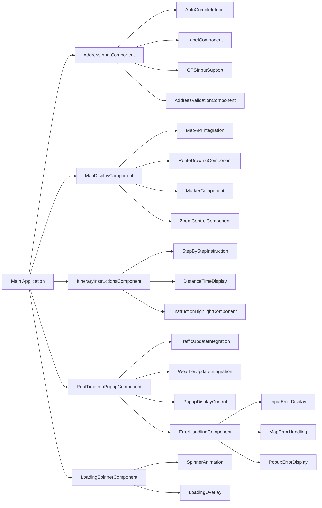
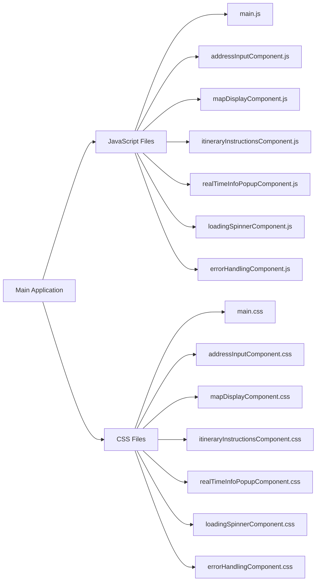

# Middleware-project

## Components

```mermaid
graph LR
    A[Main Application] --> B[AddressInputComponent]
    A --> C[MapDisplayComponent]
    A --> D[ItineraryInstructionsComponent]
    A --> E[RealTimeInfoPopupComponent]
    A --> F[LoadingSpinnerComponent]
    B --> B1[AutoCompleteInput]
    B --> B2[LabelComponent]
    B --> B3[GPSInputSupport]
    B --> B4[AddressValidationComponent]
    C --> C1[MapAPIIntegration]
    C --> C2[RouteDrawingComponent]
    C --> C3[MarkerComponent]
    C --> C4[ZoomControlComponent]
    D --> D1[StepByStepInstruction]
    D --> D2[DistanceTimeDisplay]
    D --> D3[InstructionHighlightComponent]
    E --> E1[TrafficUpdateIntegration]
    E --> E2[WeatherUpdateIntegration]
    E --> E3[PopupDisplayControl]
    E --> G[ErrorHandlingComponent]
    F --> F1[SpinnerAnimation]
    F --> F2[LoadingOverlay]
    G --> G1[InputErrorDisplay]
    G --> G2[MapErrorHandling]
    G --> G3[PopupErrorDisplay]


```

```mermaid
graph LR
    A[Main Application] --> JS[JavaScript Files]
    A --> CSS[CSS Files]
    
    JS --> J1[main.js]
    JS --> J2[addressInputComponent.js]
    JS --> J3[mapDisplayComponent.js]
    JS --> J4[itineraryInstructionsComponent.js]
    JS --> J5[realTimeInfoPopupComponent.js]
    JS --> J6[loadingSpinnerComponent.js]
    JS --> J7[errorHandlingComponent.js]
    
    CSS --> C1[main.css]
    CSS --> C2[addressInputComponent.css]
    CSS --> C3[mapDisplayComponent.css]
    CSS --> C4[itineraryInstructionsComponent.css]
    CSS --> C5[realTimeInfoPopupComponent.css]
    CSS --> C6[loadingSpinnerComponent.css]
    CSS --> C7[errorHandlingComponent.css]
    

```